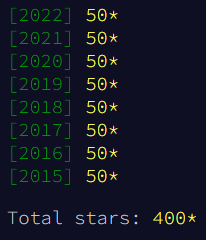

# Advent of Code

Public Repo for Advent of Code Solutions



# Setup

## Install Requirements

```
pip install -r scripts/requirements.txt
```

## Set Aliases

```
alias a_run="./scripts/advent.py run"
alias a_gen="./scripts/advent.py generate"
alias a_graph="./scripts/advent.py graph"
```

# Run

The `run` target is used to run various days rather than running directly.

Does some hacky stuff to set arguments and run commands, but for the most part runs
standard build commands for each language / framework.

None of the parameters are required, the default behavior in this case is to run the
latest day in the fastest language it is implemented in.

- Alias Command: `a_run`
- Direct Command: `./scripts/advent.py run`

## Usage

```
a_run \
  --template <template>? \
  (--year <year>)* \
  (--day <day>)* \
  (--language <language>)* \
  --test? \
  --info?
```

| Variable Name | Alt  | Description                             | Default  | Example           |
| ------------- | ---- | --------------------------------------- | -------- | ----------------- |
| template      | `-t` | Name that targets specific years / days | `latest` | `-t languages`    |
| year          | `-y` | List of years to run                    | None     | `-y 2021 -y 2022` |
| day           | `-d` | List of days to run                     | None     | `-d 1 -d 3 -d 5`  |
| language      | `-l` | Limit runs to the specified languages   | None     | `-l golang`       |
| test          | N/A  | Passes test flag to each day            | `False`  | `--test`          |
| info          | `-i` | Outputs which days would run            | `False`  | `-i`              |

- If `template` is provided then `year` & `day` must not be provided
- If `year` or `day` are provided then `template` must not be provided

## Process Runtime Output

```
jq -r '.[]|[.year, .day, .language, .runtime]|@tsv' all.json
jq -r '.[]|[.year, .day, .language, .runtime]|@tsv' all.json | sort -nk4
jq -r '.[]|.runtime' all.json | awk '{ sum+=$1 } END { print "Seconds:", sum; print "Minutes:", sum / 60 }'
jq -r '.[]|[.year, .day, .runtime]|@tsv' all.json | sort -rnk3 | awk '{ if ($3 > 1) { print $0 } }'
jq -r '.[]|select(.year == 2015 and .day == 24)' all.json
```

## Unit Test

This will test that some shared logic works across usage days. Such as the `int-code` implementation
from 2019.

```
pytest -s
```

# Generate

The `generate` target creates initial files and empty data file for the specified language.

Will do any other required setup, such as updating `Cargo.toml` for `rust`.

Will pull down your puzzle input if [instructions](#install-aoc-cli) are followed.

None of the parameters are required, the default behavior in this case is to generate the
next day using the rust template.

- Alias Command: `a_gen`
- Direct Command: `./scripts/advent.py generate`

## Usage

```
a_gen \
  --template <template>? \
  --year <year>? \
  --day <day>? \
  --language <language>? \
  --info?
```

| Variable Name | Alt  | Description                             | Default | Example     |
| ------------- | ---- | --------------------------------------- | ------- | ----------- |
| template      | `-t` | Name that targets specific year / day   | `next`  | `-t next`   |
| year          | `-y` | Year to generate starting files for     | None    | `-y 2022`   |
| day           | `-d` | Day to generate starting files for      | None    | `-d 5`      |
| language      | `-l` | Language to generate starting files for | `rust`  | `-l python` |
| info          | `-i` | Outputs which day would get generated   | `False` | `-i`        |

- If `template` is provided then `year` & `day` must not be provided
- If `year` or `day` are provided then `template` must not be provided

## Install aoc-cli

Template generation script can use `aoc-cli` to download input: [docs](https://github.com/scarvalhojr/aoc-cli).

Follow the instructions in the `README` of `aoc-cli` to get your session cookie setup.

This library relies on openssl which you will also need to install if you don't already have it.

```
cargo install aoc-cli
touch .adventofcode.session
```

# Graph

The `graph` target creates a variety of graphs to visualize the runtime of days split and
grouped on different dimensions.

None of the parameters are required, the default behavior in this case is to create only
new graphs and skip graphs that have been created before.

- Alias Command: `a_graph`
- Direct Command: `./scripts/advent.py graph`

## Usage

```
a_graph \
  --archive? \
  --info?
```

| Variable Name | Alt  | Description                             | Default | Example |
| ------------- | ---- | --------------------------------------- | ------- | ------- |
| archive       | `-a` | Archive existing graphs                 | `False` | `-a`    |
| info          | `-i` | Outputs whether graphs would be arhived | `False` | `-i`    |

# Take over 1 second on M2 Mac

| Year | Day | Runtime | Language | Notes                                                   |
| ---- | --- | ------- | -------- | ------------------------------------------------------- |
| 2022 | 16  | 4.603   | Rust     | Path finding with multiple agents is fairly optimized   |
| 2021 | 23  | 3.247   | Go       | Looks like a complex path finding problem               |
| 2019 | 18  | 2.235   | Java     | Mostly the Java runtime for such a small execution      |
| 2016 | 25  | 2.018   | Python   | Kinda like int-code, can probably make it faster        |
| 2016 | 11  | 2.009   | Python   | That chips and generator problem, not fun               |
| 2019 | 17  | 1.993   | Python   | Annoying int-code that hasn't been moved to Rust        |
| 2016 | 14  | 1.664   | Go       | Already batched implementation of md5                   |
| 2019 | 23  | 1.621   | Python   | Kinda annoying int-code that hasn't been moved to Rust  |
| 2019 | 24  | 1.607   | Python   | Game of life problem, optimized by using tuples         |
| 2018 | 15  | 1.509   | Rust     | Complex game state with path finding between characters |
| 2021 | 12  | 1.490   | Go       | Path finding problem, might be some room to improve     |
| 2022 | 15  | 1.483   | Rust     | Dealing with large space, already in Rust               |
| 2016 | 5   | 1.471   | Go       | Final md5 hash that isn't running under 1 second        |
| 2019 | 25  | 1.419   | Rust     | Mostly spends time permuting through the items          |
| 2020 | 15  | 1.249   | Rust     | Even in Rust iterating to 30,000,000 takes a bit        |
| 2018 | 24  | 1.153   | Python   | Complex game, fairly optimized in Python                |
| 2019 | 20  | 1.132   | Java     | Mostly the Java runtime for such a small execution      |

# Add Type Hints to (eventually)

* 2018/12
* 2018/13
* 2018/16
* 2018/17
* 2018/20
* 2018/21
* 2018/23
* 2018/25
* 2019/03
* 2019/06
* 2019/10
* 2019/14
* 2019/22
* 2020/01
* 2020/02
* 2020/03
* 2020/04
* 2020/05
* 2020/06
* 2020/07
* 2020/08
* 2020/09
* 2020/10
* 2020/12
* 2020/13
* 2020/14
* 2020/16
* 2020/17
* 2020/18
* 2020/19
* 2020/20
* 2020/21
* 2020/22
* 2020/25
