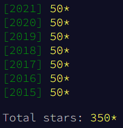

# Advent of Code

Public Repo for Advent of Code Solutions



## Install Requirements

```
pip install -r scripts/requirements.txt
```

## Set Aliases

Add to your `~/.bashrc` or `~/.zshrc`:

```
# Advent Aliases
alias a_run="./scripts/advent.py run"
alias a_gen="./scripts/advent.py generate"
```

## Running a Day

Used to run various days rather than running directly.

Does lots of hacky stuff to set environment variables, compile common directories,
and set arguments to run commands.

None of the parameters are required, the default behavior in this case is to run the
latest day in all languages it is implemented in.

- Alias Command: `a_run`
- Direct Command: `./scripts/advent.py run`

### Usage

```
a_run \
  --template <template>? \
  (--year <year>)* \
  (--day <day>)* \
  --language <language>? \
  --test? \
  --info?
```

| Variable Name | Alt  | Description                             | Default  | Example           |
| ------------- | ---- | --------------------------------------- | -------- | ----------------- |
| template      | `-t` | Name that targets specific years / days | `latest` | `-t all_langs`    |
| year          | `-y` | List of years to run                    | None     | `-y 2021 -y 2022` |
| day           | `-d` | List of days to run                     | None     | `-d 1 -d 3 -d 5`  |
| language      | `-l` | Limit runs to the specified language    | None     | `-l golang`       |
| test          | N/A  | Passes test flag to each day            | `False`  | `--test`          |
| info          | `-i` | Outputs which days would run            | `False`  | `-i`              |

- If `template` is provided then `year` & `day` must not be provided
- If `year` or `day` are provided then `template` must not be provided

## Generate Template

Generates initial files and empty data file for the specified language.

Will do any other required setup, such as updating `Cargo.toml` for `rust`.

Will pull down your puzzle input if [instructions](##install-aoc-cli) are followed.

None of the parameters are required, the default behavior in this case is to generate the
next day using the rust template.

- Alias Command: `a_gen`
- Direct Command: `./scripts/advent.py generate`

### Usage

```
a_gen \
  --template <template>? \
  --year <year>? \
  --day <day>? \
  --language <language>? \
  --info?
```

| Variable Name | Alt  | Description                             | Default | Example     |
| ------------- | ---- | --------------------------------------- | ------- | ----------- |
| template      | `-t` | Name that targets specific year / day   | `next`  | `-t next`   |
| year          | `-y` | Year to generate starting files for     | None    | `-y 2022`   |
| day           | `-d` | Day to generate starting files for      | None    | `-d 5`      |
| language      | `-l` | Language to generate starting files for | `rust`  | `-l python` |
| info          | `-i` | Outputs which day would get generated   | `False` | `-i`        |

- If `template` is provided then `year` & `day` must not be provided
- If `year` or `day` are provided then `template` must not be provided

### Install aoc-cli

Template generation script can use `aoc-cli` to download input: [docs](https://github.com/scarvalhojr/aoc-cli).

- The presense of the `.adventofcode.session` in the repo top level directory enables this logic
- To set this up create the file and follow the instructions in the `README` of `aoc-cli` to get your session cookie

This library relies on openssl which you will also need to install if you don't already have it.

Commands:

```
sudo apt-get install pkg-config libssl-dev
cargo install aoc-cli
touch .adventofcode.session
```

## In Progress Updates

### Add Threading to 2016/05

```
fn get_password_threaded(door_id: &str, populator: impl PasswordPopulator) {
    let (tx, rx) = mpsc::channel();

    for i in 0..1_000_000 {
        let tx1 = tx.clone();
        thread::spawn(move || {
            let hash = get_hash("abc", i);
            if &hash[0..5] == "00000" {
                tx1.send(hash).unwrap();
            }
        });
    }

    for received in rx {
        println!("Got: {}", received);
    }
}
```

## Take Over 10 Seconds On Both Dell XPS 15 & M2 Mac

| Year | Day | Dell XPS 15 Time | M2 Mac Time |
| ---- | --- | ---------------- | ----------- |
| 2016 | 5   | 0:25.13          | 0:16.48     |
| 2016 | 14  | 0:35.59          | 0:17.61     |
| 2017 | 15  | 1:21.71          | 0:28.22     |
| 2017 | 17  | 0:38.75          | 0:25.87     |
| 2017 | 22  | 1:02.91          | 0:17.07     |
| 2017 | 25  | 1:09.87          | 0:14.86     |
| 2018 | 11  | 1:28.29          | 0:21.12     |
| 2018 | 14  | 0:35.87          | 0:11.54     |
| 2018 | 15  | 3:59.39          | 0:49.88     |
| 2018 | 18  | 1:09.36          | 0:14.82     |
| 2019 | 13  | 0:24.05          | 0:12.27     |
| 2019 | 25  | 1:52.72          | 0:55.82     |
| 2020 | 15  | 0:58.97          | 0:31.61     |

## Take Over 10 Seconds On Only Dell XPS 15

| Year | Day | Dell XPS 15 Time | M2 Mac Time |
| ---- | --- | ---------------- | ----------- |
| 2015 | 10  | 0:15.86          | 0:05.22     |
| 2015 | 18  | 0:26.12          | 0:09.02     |
| 2015 | 20  | 0:14.64          | 0:06.73     |
| 2015 | 22  | 0:22.70          | 0:07.63     |
| 2015 | 24  | 0:12.34          | 0:05.08     |
| 2016 | 12  | 0:35.69          | 0:09.74     |
| 2016 | 18  | 0:26.21          | 0:04.44     |
| 2017 | 14  | 0:14.21          | 0:04.97     |
| 2018 | 5   | 0:10.89          | 0:03.69     |
| 2018 | 6   | 0:12.14          | 0:05:02     |
| 2018 | 10  | 0:10.61          | 0:04.48     |
| 2018 | 19  | 0:16.66          | 0:05.19     |
| 2018 | 24  | 0:10.01          | 0:03.60     |
| 2019 | 12  | 0:18.32          | 0:05.26     |
| 2019 | 16  | 0:12.88          | 0:04.71     |
| 2019 | 19  | 0:17.07          | 0:05.00     |
| 2019 | 21  | 0:10.37          | 0:03.25     |
| 2019 | 24  | 0:20:31          | 0:05.73     |
| 2020 | 11  | 0:14.67          | 0:03.87     |
| 2020 | 23  | 0:21.99          | 0:05.66     |
| 2020 | 24  | 0:13.45          | 0:04.85     |
