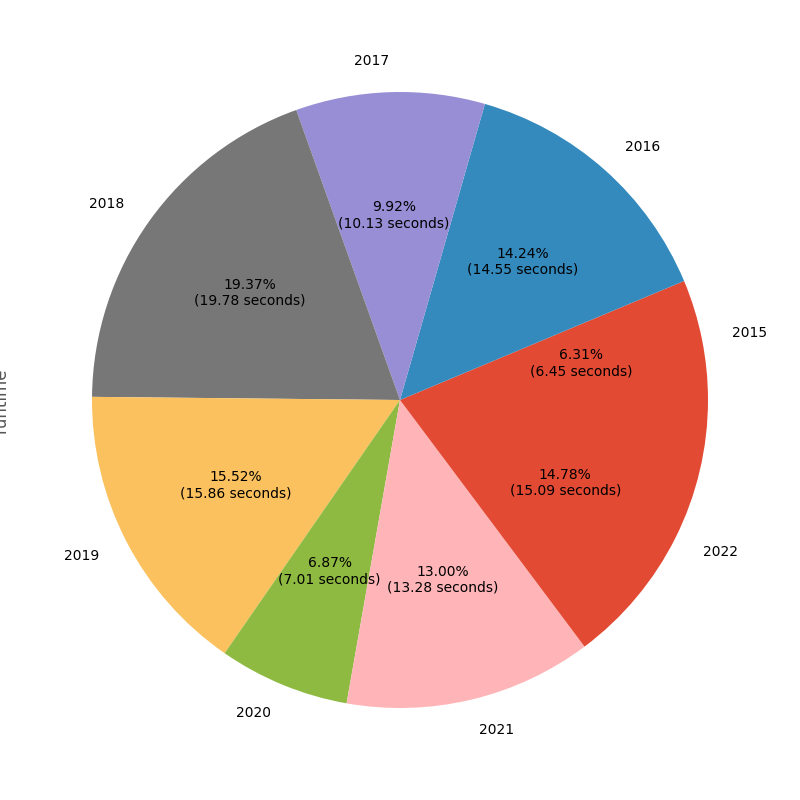

# Advent of Code

All Years - Blazingly Fast


# Runtimes



# History

When I first started Advent in 2020 I wrote everything in `Python` for simplicity
as well as getting better at my main scripting language.

I then decided to go back and solve all the years from 2015 on also in `Python`.

Since then I have used Advent as an opportunity to learn new languages.

So far this has been:

- 2021: [Go](https://go.dev/)
- 2022: [Rust](https://www.rust-lang.org/)
- 2023: [OCaml](https://ocaml.org/)

Sometime after 2022 I decided to go back and optimize every solution with the goal
of having no single solution take more than 1 second to run.

Sometimes this involves algorithm improvements, other times I decided to re-write
solutions from `Python` into something like `Rust` or `Go`.

Since there are only a couple outliers and nothing runs longer than 2 seconds I
consider this goal completed.

# Input Data

<details>

<summary>The input for each puzzle is in a separate private Github repo</summary>

This is done to comply with the policy [here](https://adventofcode.com/about).

These inputs end up in the `data` folder in the same structure as the solutions.

For instance the input for year `2020` day `5` is file `data/2020/05/data.txt`.

After cloning this repo the following command needs to be run to get the data.

```bash
git submodule update --init
```

This also means when pulling changes the `update` command must also be ran.

```bash
git submodule update
```

</details>

# Setup

## Install Requirements

```bash
pip install -r scripts/requirements.txt
```

## Set Aliases

```bash
alias a-build="./scripts/advent.py build"
alias a-run="./scripts/advent.py run"
alias a-gen="./scripts/advent.py generate"
alias a-graph="./scripts/advent.py graph"
```

# Build

The `build` target is used to do any language specific setup prior to running.

This includes downloading any necessary libraries, compiling targets, etc.

None of the parameters are required, the default behavior in this case is to
build and test all supported languages.

- Alias Command: `a-build`
- Direct Command: `./scripts/advent.py build`

<details>

<summary>Usage</summary>

```bash
a-build \
  (--language <language>)* \
  --info?
```

| Variable Name | Alt  | Description                            | Default | Example   |
| ------------- | ---- | -------------------------------------- | ------- | --------- |
| language      | `-l` | Limit build to the specified languages | None    | `-l rust` |
| info          | `-i` | Outputs which languages will be built  | `False` | `-i`      |

</details>

# Run

The `run` target is used to run various days rather than running directly.

Does some hacky stuff to set arguments and run commands, but for the most part runs
standard build commands for each language / framework.

None of the parameters are required, the default behavior in this case is to run
the latest day in the fastest language it is implemented in.

- Alias Command: `a-run`
- Direct Command: `./scripts/advent.py run`

<details>

<summary>Usage</summary>

```bash
a-run \
  --template <template>? \
  (--year <year>)* \
  (--day <day>)* \
  (--language <language>)* \
  --test? \
  --info?
```

| Variable Name | Alt  | Description                             | Default  | Example           |
| ------------- | ---- | --------------------------------------- | -------- | ----------------- |
| template      | `-t` | Name that targets specific years / days | `latest` | `-t languages`    |
| year          | `-y` | List of years to run                    | None     | `-y 2021 -y 2022` |
| day           | `-d` | List of days to run                     | None     | `-d 1 -d 3 -d 5`  |
| language      | `-l` | Limit runs to the specified languages   | None     | `-l go`           |
| slow          | `-s` | Defines the runtime (in ms) for slow    | 500      | `-s 100`          |
| test          | `-T` | Passes test flag to each day            | `False`  | `-T`              |
| info          | `-i` | Outputs which days would run            | `False`  | `-i`              |

- If `template` is provided then `year` & `day` must not be provided
- If `year` or `day` are provided then `template` must not be provided

</details>

<details>

<summary>Process Runtime Output</summary>

```bash
cat all.json | jq -r '.[]|[.year, .day, .language, .runtime, .execution]|@tsv'
cat all.json | jq -r '.[]|[.year, .day, .language, .runtime]|@tsv' | sort -nk4
cat all.json | jq -r '.[]|[.year, .day, .language, .runtime]|@tsv' | sort -nk4 | awk '{ if ($4 > 100) { print $0 } }'
cat all.json | jq -r '.[]|select(.year == 2015 and .day == 24)'
cat all.json | jq -r '.[]|.runtime' | awk '{ sum+=$1 } END { print sum, "ms" }'
cat all.json | jq -r '.[]|select(.year == 2015)|.runtime' | awk '{ sum+=$1 } END { print sum, "ms" }'
cat all.json | jq -r '.[]|[.year, .runtime]|@tsv' | awk '{ data[$1] += $2 } END { for (year in data) { print year, data[year], "ms" } }'
```

</details>

<details>

<summary>Unit Test</summary>

This will test that some shared logic works across usage days. Such as the `int-code`
implementation from 2019.

```bash
pytest -s scripts
```

</details>

# Generate

The `generate` target creates initial files and empty data file for the specified
language.

Will do any other required setup, such as updating `Cargo.toml` for `rust`.

Will pull down your puzzle input if [instructions](#install-aoc-cli) are followed.

None of the parameters are required, the default behavior in this case is to generate
the next day using the rust template.

- Alias Command: `a-gen`
- Direct Command: `./scripts/advent.py generate`

<details>

<summary>Usage</summary>

```bash
a-gen \
  --template <template>? \
  --year <year>? \
  --day <day>? \
  --language <language>? \
  --puzzle? \
  --info?
```

| Variable Name | Alt  | Description                             | Default | Example     |
| ------------- | ---- | --------------------------------------- | ------- | ----------- |
| template      | `-t` | Name that targets specific year / day   | `next`  | `-t next`   |
| year          | `-y` | Year to generate starting files for     | None    | `-y 2022`   |
| day           | `-d` | Day to generate starting files for      | None    | `-d 5`      |
| language      | `-l` | Language to generate starting files for | `rust`  | `-l python` |
| puzzle        | `-p` | Download puzzle description as well     | `False` | `-p`        |
| info          | `-i` | Outputs which day would get generated   | `False` | `-i`        |

- If `template` is provided then `year` & `day` must not be provided
- If `year` or `day` are provided then `template` must not be provided

</details>

## Install aoc-cli

Template generation script can use `aoc-cli` to download input: [docs](https://github.com/scarvalhojr/aoc-cli).

Follow the instructions in the `README` of `aoc-cli` to get your session cookie setup.

This library relies on openssl which you will also need to install if you don't already
have it.

```bash
cargo install aoc-cli
touch .adventofcode.session
```

# Graph

The `graph` target creates a variety of graphs to visualize the runtime of days split
and grouped on different dimensions.

None of the parameters are required, the default behavior in this case is to create
only new graphs and skip graphs that have been created before.

- Alias Command: `a-graph`
- Direct Command: `./scripts/advent.py graph`

<details>

<summary>Usage</summary>

```bash
a-graph \
  --archive? \
  --info?
```

| Variable Name | Alt  | Description                             | Default | Example |
| ------------- | ---- | --------------------------------------- | ------- | ------- |
| archive       | `-a` | Archive existing graphs                 | `False` | `-a`    |
| info          | `-i` | Outputs whether graphs would be arhived | `False` | `-i`    |

</details>
